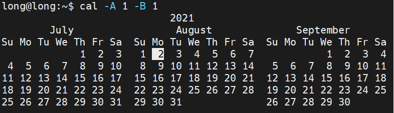

# Find out and learn new command by use Session Manual

## **1. Manual & Command structure**

### **1.1 Command structure**: `<command name> + <-/-- option> + <arguments>`

- To check a command is valid using `which + command name`. => if a path is returned, then the command name is valid.

- Option: You can specify options for each command to customize the commands behaviors. These can be `long-form` options or `short-form` option.
- Short-form options: Short-form options are where a letter defines an option. Each option is prepended by a dash `-` like so:

> `commandName -a -b -c args` or you can join together the options like `commandName -abc args`.

- Long-form options: Long-form options usually prepended by a double dash `--` and they defined for short option "a", "b", "c".

> Ex: `commandName --alpha --beta --charlie argument`

- Command Line arguments are a type of input theat command operate on. Some command can take an unlimited ammount of input, some take specific amount, and some take none at all.

> $ cal 12 2017

- Arguments for Options: command options can also take their own arguments (inputs).

> $ cal -A 1 -B 1 12 2017

### **1.2 In linux manual have number of session with specific usage**

> Note: Sections 1, 5, 8 are what you will likely use most often

## **2. Hands on**

- Use `man + -k + command to search` (ex: `man -k which`) command look through the manual. Or if you want to find command with their work => you can use `man + -k + <command effect>` (ex: `man -k "list directory contents"`). 

- When you hit this command => a number of output appear with format: `name of certain manual pages have command you have search + (session of manual)`. ex: `which (1)`

- You can go deeper by use command: `man + (session of command) + session name`.

> note: if your session of command is `1` => you don't need pass it into to command.

- when you read the session i think you have confuse about some command input require like `[THING], <THING>, THING..., THING1 | THING2,...` => It's call ``Command Synopsis``. And here is the cheat sheet for them.

- Some command defined itself in shell , not in the `manual` and you can find them by using `help` command.

> Check the `help` command support by type `$ help` in terminal and you can get the list.

