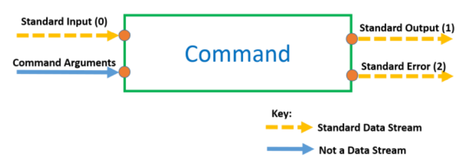

# Linux command input & output

- The power of linux command is chain the Linux command line together. To chain them we must know about command pipe line.

- Each linux command do 1 things and designed to do it well. So to chain them we must know about how Linux command actually take input and give output so that we can link output to input together.

## 1. Command Input & Output


*General Linux command flow*

> Note: standard input : 0,
standard output : 1,
standard error : 2,

- Linux command take input from 2 places and give output to two other place.

- Standard data stream can be `redirected` and are identified using their stream number.

- Redirection of the standard output of one command to the standard input of another command is known as `piping`.

- Standard data stream like a stream and standard output & standard error lead to your terminal screen. (when you type command the output appear in your screen)

- There are 2 ways to get input in a command is from `standard input` (by default connected to your keyboard ex: `cat` command if you dont give it arguments it's use your standard input)

- You can pass `standard output` in second command to `standard input` of third command and 3 can pass to 4 . . . so it's build a pipeline

## 2. Redirection

### 2.1 Redirecting Standard Output

- `Standard output` is stream number 1. There are 2 methods to redirect standard output.

- The *long-form*: using stream number:`commandName -options argument 1> destination`
- The *short-form*: without stream number:`commandName -options argument > destination`

```
$ cat 1> output.txt
or 
$ cat > output.txt
```

> Note: If You want to write new data to file you can't use single `>` because its deleting all the data in the file you have written before so you can appending to a file by using `>>` in the command.

### 2.2 Redirecting Standard Error

- Its similar to `standard ouput`.

- Standard error is stream number 2.

- Here is how to redirect standard error:
`commandName –options arguments 2> destination`

- Standard error can be redirected at the same time as standard output:
`commandName –options arguments 1> output_destination 2> error_destination`

### 2.3 Redirecting Standard Input

- Standard Input is stream number 0. There are 2 methods to redirect standard Input.

- The long form, using the stream number:
 `commandName –options arguments 0< input_source`

> ex: cat 0< input.txt

- Or the short form, with no stream number:
 `commandName –options arguments < input_source`

> ex: cat < input.txt

=> You can redirecting your data entire your computer or over the computer.

## 3. Piping

- `Piping` is the `connection` of the `standard output` of one command to the `standard input` of another command. Piping using `the pipe character |`

- Here is how you would pipe together `commandOne` and `commandTwo`:
`commandOne –options arguments | commandTwo –options arguments`

Example:

```
date | cut --delimiter " " --field 1
```

> Note: Notice how both commands can have their own options and command line arguments as usual. This piping can go on for as long as is required with as many commands as is required

- Redirecting brake the pipeline so we handle it by use `tee` & `xarg`command

### 3.1 `tee` command

For example, this wouldn’t work:

`commandOne –options arguments > snapshot.txt | commandTwo –options arguments`

- Because redirection is processed by the shell before piping is, `snapshot.txt` would be created, but this locks up the standard output stream and therefore no data can be passed through the pipeline to `commandTwo`.

- However, the `tee` command allows us to take a “snapshot” of the data in the pipeline *without* breaking the pipeline.

`commandOne –options arguments | tee snapshot.txt | commandTwo –options arguments`


EX:

```
$ date | tee fulldate.txt | cut --delimiter " " --field=1
```

### 3.2 `xarg` command:

- Piping connects the standard output of one command to the standard input of another command. But what if the second command doesn’t accept standard input? `e.g. the echo command`

=> The key is to transform the data coming in, into command line arguments by using `xarg` command

- For example, this would not work:
`commandOne –options arguments | echo`

- This would work:
`commandOne –options arguments | xargs echo`
