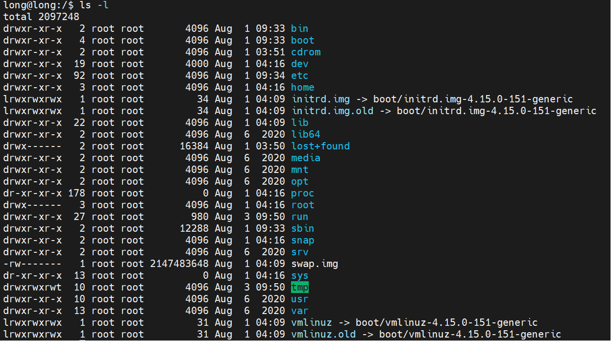

# About command in file system

- `pwd` command: show your current path

- `cd` && `cd ..` to change directory

- To list file in a directory use `ls` command :

  - Option `-F` you can list all file in directory with the folder highlight.

  - Option `-l` list all file with long form format.
   
    > Note:
    - `drwxr - xr - x`: file mode we devide into 3 group : 1-`d`, 2 - `rwx`, 3 - `r-x`, 4 - `r-x`
    - The file mode (group 1) printed consists of the file type and the permissions. The entry type character (group 1) describes the type of file

    | Character        |     File type             |
    |------------------|---------------------------|
    |     -            |    Regular file           |
    |     b            |   Block special file      |
    |     c            | Character special file    |
    |     d            |   Directory               |
    |     l            |   Symbolic link.          |
    |     p            |   FIFO                    |
    |     s            |    Socket                 |
    |     w            |    Socket                 |

    - In group 2(owner permission), group 3(permission group), group 4 (other permission group). So each field has three character positions:

    | Character        |     File type              |
    |------------------|----------------------------|
    |     r            |  Read only file permission |
    |     w            | Write only file permission |
    |     x            |Execute only file permission|
    |     -            |    No permission           |

    - `2, 4, 19, 92 ...`: Number links to file
    - `root` : file owner name
    - `root` : file group name
    - `4096, 0, ...`: number of bytes in the file
    - `bin, boot, ...`: pathname/ filename.

- file extension : use command `file + filename.type`
