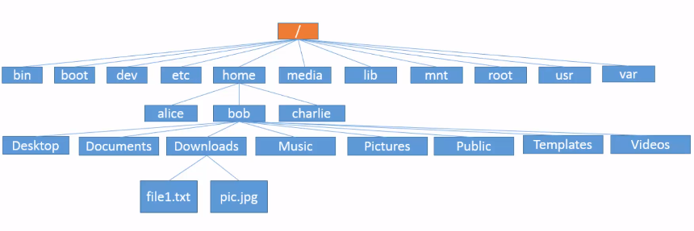

# Linux File System

## 1. The Linux File system

- Entire Linux file system follow the tree structure

- There's no partition on your hard drive, every single thigns on the system can be accessed in.

- `/` root directory: every things in OS can be trace back to that.

- All directory under `\` is subdirectory

- Let's look through the directory in a Linux file system:

- `/`: The Very Top (Root) of The File Tree. Holds Everything else
- `/bin`: Stores Common Linux user command `bin`aries. e.g date, cat, cal commands are in here.

- `/boot`: Bootable linux Kernel and bootloader config files

-`/dev`: Files representing `dev`ices. if it start with `tty` => terminal `fd` => floppy disk, (sd or hd) => hard disks, `ram` => RAM, `cd` => CD-ROM

-`/etc`: Administrative Configuration files. The format for many of these configuration can be found in section 5 of the Linux Manual.

-`/home`: Where the home directories for regular users are stored. For example, mine is at /home/long

-`/media`: Unlike /dev, /media is usually where removable media (USB sticks, external hard drives etc.) are mounted

-`/lib`: Contains shared libraries needed by applications in
`/bin` and `/sbin` to boot the system.

-`/mnt`: A place to mount external devices. This can still be used but has been superseded by `/media`

-`/misc`: A directory used to sometimes automount filesystems on request.

-`/opt`: Directory Structure used to store additional (i.e `opt`ional) software

-`/proc`: Information about System Resources

-`/root`: The home folder for the root user aka the superuser (similar to the administrator on Windows)

-`/sbin`: Contains administrative commands (binaries) for the root (super) user.

-`/tmp`: Contains `temp`orary files used by running applications

-`/usr`: Contains files pertaining to users that in theory
don’t change after installation. Store application programs

-`/var`: Contains directories of `var`iable data that could be used by various applications. System log files are usually found here, mails, other data.

[Read more about file system here](https://www.cyberciti.biz/tips/understanding-unixlinux-file-system-part-i.html)

[About Template file in /home directory](https://askubuntu.com/questions/94734/what-is-the-templates-folder-in-the-home-directory-for)
